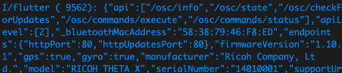
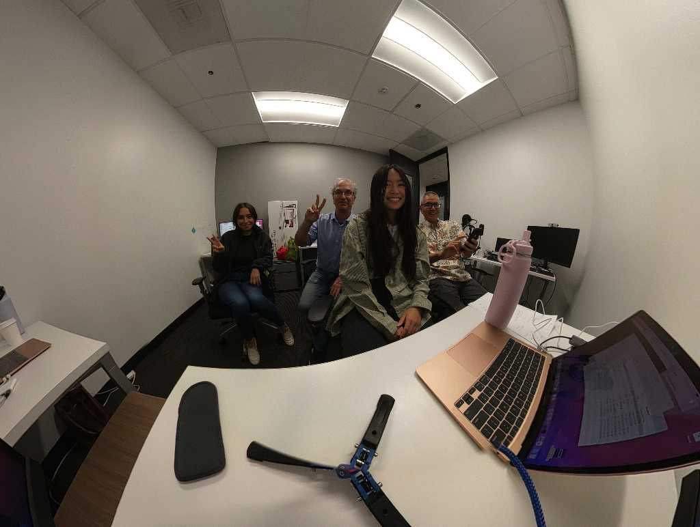

# THETA X Button Controls using HTTP


This application does not use state management, but uses the [http](https://pub.dev/packages/http) package from Dart to connect to a RICOH THETA X camera. Using the http commands, such as GET and POST, the application receives information and executes commands. Below is a list of this project's button controls using the [THETA WebAPI](https://api.ricoh/docs/theta-web-api-v2.1/). 

## Button Controls

* [Info](https://api.ricoh/docs/theta-web-api-v2.1/protocols/info/)
* [State](https://api.ricoh/docs/theta-web-api-v2.1/protocols/state/)
* [camera.takePicture](https://api.ricoh/docs/theta-web-api-v2.1/commands/camera.take_picture/)

## http Package

In order to use the http package, I first needed to download it and import it at the top of my file. All HTTP requests require a url. For example, this is the url for getting the info from the camera. 

```
var url = Uri.parse('http://192.168.1.1/osc/info');
```

Next, I created a header using a key-value pair. 

```
var header = {
    'Content-Type': 'application/json;charset=utf-8'}
```

Finally, the http method is sent out and assigned to a variable called `response`.

```
var response = await http.get(url, headers: header);
```

At the moment, this application does not display any response to the screen, instead, the output is printed out to the console. 



## Take Picture 📷

The command for taking a picture differs slightly from the info and state buttons as we need to run `jsonEncode`. The url for taking the picture uses `/osc/commands/execute` as shown below.

```
var url = Uri.parse('http://192.168.1.1/osc/commands/execute');
```

I created a map called `bodyMap` that stores the key-value pair from the camera. Next, I had to encode the map into Json, so I could pass it into my response. 

```
var bodyMap = {'name': 'camera.takePicture'};
var bodyJson = jsonEncode(bodyMap);
```

The response requires the url, but I also passed in the `bodyJson`.

```
  var response = await http.post(url, headers: header, body: bodyJson);
```

As the response is a POST request, the application sends out information and takes a picture. 



## JSON Decode

To access certain properties in the state of the camera, the response from the camera needs to be decoded. After the response is decoded, a specific property, such as `batteryLevel`, can be accessed as a map. In the future, I can use this `batteryLevel` to update the state of the application. 

```
var thetaState = jsonDecode(response.body);
var batteryLevel = thetaState['state']['batteryLevel'];
```
