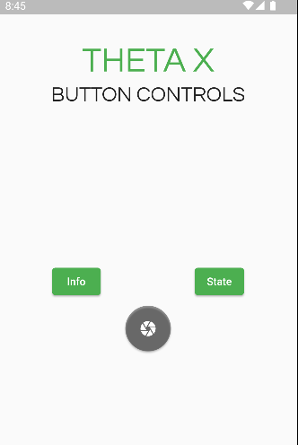
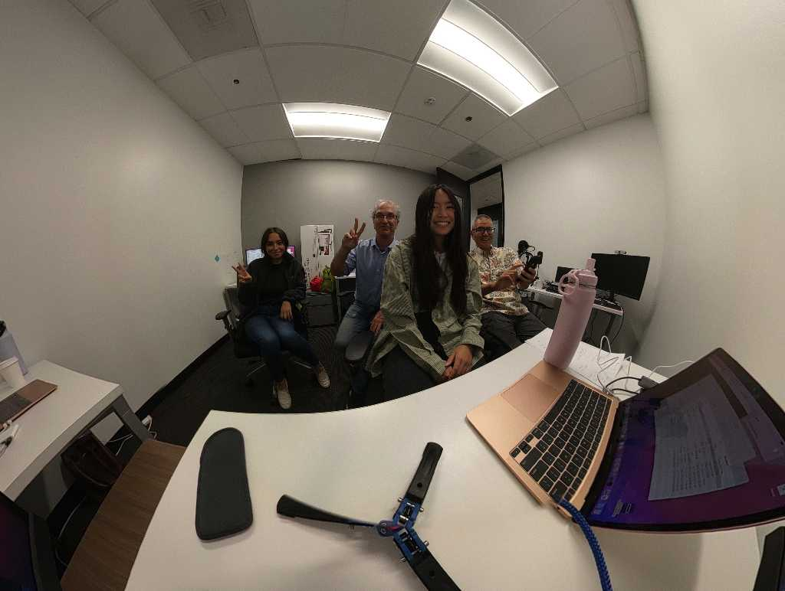

# Sending an API command to the camera

This tutorial is the first in a series aimed at helping developers learn how to work with the RICOH THETA X camera. It focuses on using the API to build a mobile app. The examples provided use Flutter to build mobile apps. Source code is downloadable and open to pull requests on GitHub.

# Main Resources

* [RICOH THETA API](https://api.ricoh/docs/theta-web-api-v2.1/)
* [theta360.guide developers community](https://theta360.guide/)
* [Code for this tutorial](https://github.com/theta360developers/theta_x_gs1)

# Main steps in Sending an API command to the camera

* The camera works as a hotspot, you connect to it via Wi-Fi. Example: 
* The camera password is the numerical digits only of the camera SSID. Example: Full SSID is YR14010005, so password is 14010005
* You must use http, not https. You may need to adjust mobile app network security settings
* Must connect to 192.168.1.1 and the end point cannot be changed
* You use HTTP GET, HTTP POST, and HTTP POST with body commands. The body must be encoded as JSON
* You must send a header. The header in this tutorial is used as a Dart map with the http package. This tutorial only covers access point mode, not client mode

# THETA X Button Controls using HTTP



This application does not use state management, but uses the [http](https://pub.dev/packages/http) package from Dart to connect to a RICOH THETA X camera. Using the http commands, such as GET and POST, the application receives information and executes commands. Below is a list of this project's button controls using the [THETA WebAPI](https://api.ricoh/docs/theta-web-api-v2.1/). 

## Button Controls

* [Info](https://api.ricoh/docs/theta-web-api-v2.1/protocols/info/)
* [State](https://api.ricoh/docs/theta-web-api-v2.1/protocols/state/)
* [camera.takePicture](https://api.ricoh/docs/theta-web-api-v2.1/commands/camera.take_picture/)

## http Package

In order to use the http package, I first needed to download it and import it at the top of my file. All HTTP requests require a url. For example, this is the url for getting the info from the camera. 

```
var url = Uri.parse('http://192.168.1.1/osc/info');
```

Next, I created a header using a key-value pair. 

```
var header = {
    'Content-Type': 'application/json;charset=utf-8'}
```

Finally, the http method is sent out and assigned to a variable called `response`.

```
var response = await http.get(url, headers: header);
```

At the moment, this application does not display any response to the screen, instead, the output is printed out to the console. 


## Take Picture 📷

The command for taking a picture differs slightly from the info and state buttons as we need to run `jsonEncode` on the request body that is sent to the camera. The url for taking the picture uses `/osc/commands/execute` as shown below.

```
var url = Uri.parse('http://192.168.1.1/osc/commands/execute');
```

I created a map called `bodyMap` that stores the key-value pair from the camera. Next, I had to encode the map into Json, so I could pass it into the request body. 

```
var bodyMap = {'name': 'camera.takePicture'};
var bodyJson = jsonEncode(bodyMap);
```

The response requires the url, but I also passed in the `bodyJson`.

```
  var response = await http.post(url, headers: header, body: bodyJson);
```

As the response assignment runs a POST request, the application sends out information and takes a picture. 



## JSON Decode

To access certain properties in the state of the camera, the response from the camera needs to be decoded. After the response is decoded, a specific property, such as `batteryLevel`, can be accessed as a map. In the future, I can use this `batteryLevel` to update the state of the application. 

```
var thetaState = jsonDecode(response.body);
var batteryLevel = thetaState['state']['batteryLevel'];
```
